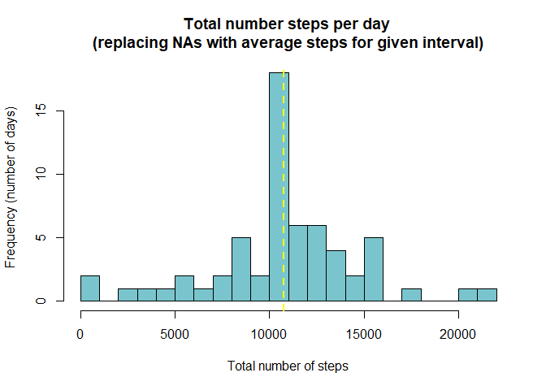

```r
library(dplyr)
```

```
## 
## Attaching package: 'dplyr'
```

```
## The following objects are masked from 'package:stats':
## 
##     filter, lag
```

```
## The following objects are masked from 'package:base':
## 
##     intersect, setdiff, setequal, union
```

```r
library(lattice)
```

## Loading and preprocessing the data
Read data from the file and store it in the variable activity.

```r
activity <- read.csv('activity.csv')
```
Take a look at the data

```r
str(activity)
```

```
## 'data.frame':	17568 obs. of  3 variables:
##  $ steps   : int  NA NA NA NA NA NA NA NA NA NA ...
##  $ date    : chr  "2012-10-01" "2012-10-01" "2012-10-01" "2012-10-01" ...
##  $ interval: int  0 5 10 15 20 25 30 35 40 45 ...
```

```r
head(activity)
```

```
##   steps       date interval
## 1    NA 2012-10-01        0
## 2    NA 2012-10-01        5
## 3    NA 2012-10-01       10
## 4    NA 2012-10-01       15
## 5    NA 2012-10-01       20
## 6    NA 2012-10-01       25
```

```r
summary(activity)
```

```
##      steps            date              interval     
##  Min.   :  0.00   Length:17568       Min.   :   0.0  
##  1st Qu.:  0.00   Class :character   1st Qu.: 588.8  
##  Median :  0.00   Mode  :character   Median :1177.5  
##  Mean   : 37.38                      Mean   :1177.5  
##  3rd Qu.: 12.00                      3rd Qu.:1766.2  
##  Max.   :806.00                      Max.   :2355.0  
##  NA's   :2304
```

## What is mean total number of steps taken per day?

Calculate the total number of steps taken per day

```r
steps_by_date <- select(activity, steps, date, interval) %>%
    group_by(date) %>% 
    summarize(total_steps = sum(steps, na.rm = TRUE))
```

```
## `summarise()` ungrouping output (override with `.groups` argument)
```

Plot a histogram, mark the mean and median.

```r
# plot
hist(steps_by_date$total_steps, 
	main = "Total number of steps taken per day", 
	xlab = "Total number of steps", 
	ylab = "Frequency (number of days)", 
	breaks = 20,
	col = "cadetblue3")

# calculate and report mean and median
mean_steps <- mean(steps_by_date$total_steps)
median_steps <- median(steps_by_date$total_steps)

abline(v = mean_steps, lwd = 2, pch = 2, lty = 2, col = "red")
abline(v = median_steps, lwd = 2, pch = 2, lty = 2, col = "yellow")
```

<!-- -->

The daily mean steps is 9354.23 steps and the median daily is 10395 steps

## What is the average daily activity pattern?
Get the average steps per interval and maximum steps.

```r
steps_by_interval <- select(activity, steps, date, interval) %>%
    group_by(interval) %>% 
    summarize(avg_steps = mean(steps, na.rm = TRUE))
```

```
## `summarise()` ungrouping output (override with `.groups` argument)
```

```r
max_steps <- max(steps_by_interval$avg_steps)

max_steps_interval <- steps_by_interval[steps_by_interval$avg_steps == max_steps,]$interval
```
According to the calculation of ``max_steps`` and ``max_steps_interval``, the interval of 835 contains the maximum number of steps, which is 206.1698.

Then we plot the average daily pattern.

```r
plot(steps_by_interval$interval, steps_by_interval$avg_steps, type = "l",
	main = "Average steps by interval",
	xlab = "Interval",
	ylab = "Average number of steps")

abline(v = max_steps_interval, lwd = 1, lty = 2, col = "red")
abline(h = max_steps, lwd = 1, lty = 2, col = "red")
```

<!-- -->

## Imputing missing values
Calculate the total number of records with missing values.

```r
NA_number <- count(activity[which(is.na(activity$steps)),])
```
The number of missing values is 2304.  
Then we replace the missing values with the mean for that interval and store in a new dataset ``new_activity``.

```r
new_activity <- activity
for (r in 1:nrow(new_activity)){
    if (is.na(new_activity$steps[r])) {
		i <- new_activity$interval[r]
		mean_steps <- steps_by_interval[steps_by_interval$interval==i,]$avg_steps
		new_activity$steps[r] <- mean_steps
	}
}
```

Calculate new total number of steps taken each day and mean and median.

```r
new_steps_by_date <- select(new_activity, steps, date, interval) %>% 
    group_by(date) %>% 
    summarize(total_steps = sum(steps, na.rm = TRUE))
```

```
## `summarise()` ungrouping output (override with `.groups` argument)
```

```r
new_mean_steps <- mean(new_steps_by_date$total_steps)
new_median_steps <- median(new_steps_by_date$total_steps)
```
Plot a histogram.

```r
hist(new_steps_by_date$total_steps, 
	main = "Total number steps per day \n(replacing NAs with average steps for given interval)", 
	xlab = "Total number of steps", 
	ylab = "Frequency (number of days)", 
	breaks = 20,
	col = "cadetblue3")

abline(v = new_mean_steps, lwd = 2, lty = 2, col = "red")
abline(v = new_median_steps, lwd = 2, lty = 2, col = "yellow")
```

<!-- -->

The daily mean steps is 10766.19 steps and the median daily is 10766.19 steps.
The mean and median of total steps are larger than in the first part. 

## Are there differences in activity patterns between weekdays and weekends?
Get average number of steps per weekday/weekend and interval

```r
weekday_id <- weekdays(as.Date(new_activity$date))
weekday_sep <- as.factor(ifelse(weekday_id=="Saturday" | weekday_id=="Sunday", "weekend", "weekday"))

activity_weekday <- mutate(new_activity, weekday_id, weekday_sep)

new_steps_by_interval_weekday <- select(activity_weekday, steps, date, interval, weekday_sep) %>% 
    group_by(weekday_sep, interval) %>% 
    summarize(avg_steps = mean(steps, na.rm = TRUE))
```

```
## `summarise()` regrouping output by 'weekday_sep' (override with `.groups` argument)
```

Then we plot the new average daily pattern.

```r
xyplot(avg_steps ~ interval | weekday_sep, data = new_steps_by_interval_weekday, layout = c(1,2), type = "l",
	main = "Average steps by interval",
	xlab = "Interval",
	ylab = "Average number of steps")
```

<!-- -->
